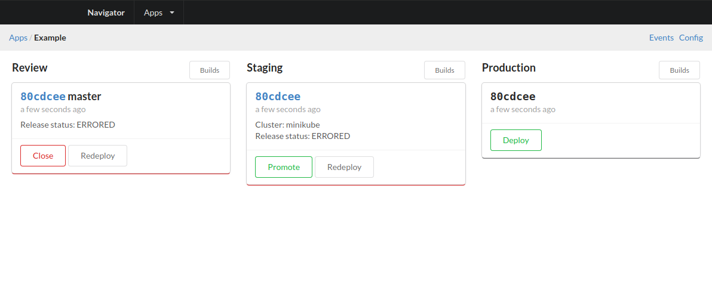

# Navigator

Pipeline based deployment management for Kubernetes and more.



- [Getting Started](#getting-started)
- [Installation](#installation)
- [Application Configuration](#application-configuration)
- [Recipes](docs/recipes)
- [Releases](#releases)
- [API](#api)
- [CLI](#cli)

<hr>

## Getting Started

Run navigator on port 4000 locally:

    docker run \
      -e AUTH_DISABLED=true \
      -p 4000:4000 \
      --rm -it \
      coldog/navigator:latest

Install the navctl CLI locally.

    curl https://raw.githubusercontent.com/ColDog/navigator/master/hack/install.sh | sudo bash

We need to setup an example application. Copy the configuration to a
local file on disk and then we can apply the configuration to the local server.

    curl https://raw.githubusercontent.com/ColDog/navigator/master/example/app.json > app.json
    navctl apply app.json

Once this is applied, you should be able to open up https://localhost:4000 and
see the `Example` app is ready. Now we can add a build to the review pipeline:

    navctl build -a example -n pr1234 -s review -v v1

If you open up the app again, you should see an application in the review stage.
We can also easily create a build in the staging stage like so:

    navctl build -a example -s staging -v v1

And with this build we can also try rolling this out to production if we want
to by promoting the build on staging. Note, nothing was actually deployed here
the script is using a mock deployment script which simply sleeps for a period
to emulate a deploy. This short guide has hopefully given you a short intro to
navigator.

To move this into your release workflow you can manage the releases through your
CI provider. The [example application](example) can provide a basic release
example for a CI workflow.

## Installation

Install the cli tool locally:

    curl https://raw.githubusercontent.com/ColDog/navigator/master/hack/install.sh | sudo bash

Run the navigator server locally on port 4000:

    docker run \
      -e AUTH_DISABLED=true \
      -p 4000:4000 \
      --rm -it \
      coldog/navigator:latest

Kubernetes installation is done using the navigator helm chart, view
configuration options and installation instructions in the
[chart directory](charts/navigator).

## Application Configuration

The application configuration is described by a
[json schema](docs/schema/app.json) format for the application.

Example:

```javascript
{
  // Application name.
  "name": "example",
  "config": {
    // Deploy script to execute for the deployment, usually `deploy`.
    "deploy": "mock-deploy",
    // Chart url, uses go-getter syntax.
    "chart": "github.com/ColDog/navigator.git//charts/service?ref=123",
    "values": {
      // Set the image.tag value to the current build version.
      "image": true
    }
  },
  // A stage represents often an environment or set of configuration in your
  // release pipeline, usually 'staging' and 'production' are stages.
  "stages": [
    {
      "name": "review",
      "review": true,     // Is this a review stage?
      "auto": true,       // Should we auto deploy builds?
      "promotion": true,  // Allows promotion to the next stage.
      "clusters": [
        {
          "name": "minikube",     // Cluster name.
          "namespace": "default", // Kubernetes namespace.
          "values": {             // Helm chart values.
            "image": {
              "repository": "coldog/nginx"
            }
          }
        }
      ]
    }
  ]
}
```

## Releases

Releases can be whatever fits into a script that can accept command line
arguments. By default, navigator comes with the ability to deploy to Kubernetes
using helm.

### Values

The values that are passed to the release script are merged from the values set
at the cluster level inside the application manifest and the values set on the
command line for a specific build.

If you configure `config.values.image` in your application manifest, then
navigator will set the following values on every deploy:

```yaml
image:
  tag: ${version}
```

During canary releases the following values will be set. It is up to the release
helm chart to handle these values appropriately to configure a canary release.

```yaml
canary:
  enabled: true
  tag: ${canary,version}
  weight: ${canary.weight}
```

The default [service helm chart](charts/service) combines these features along
with support for istio if desired.

### Helm Releaser

Read more about the [default release script](deployer).

### Deploy Scripts

Deploy scripts execute a deploy and write logs to stdout from the deployment.
Command line flags are passed into the script

- `-r`: Release ID.
- `-b`: Chart url.
- `-c`: Cluster name.
- `-n`: Namespace name.
- `-s`: Stage name.
- `-a`: App name.
- `-v`: Version.
- `-q`: JSON encoded values.

The default deployment script will apply a chart into the cluster without
requiring helm to be installed instead it will render the templates into the
cluster.

### Charts

The default release chart is at [charts/service](charts/service).

## API

The API is available at `/api/v1/` from where you are running it. See the main
authentication section for handling authentication.

Currently the endpoints are undocumented the CLI and application are the main
way to interact with the API.

## CLI

The CLI tool `navctl` is the main instrumentation point for inserting a build
into the pipeline. It has two commands `apply` and `build`. Read further in the
embedded CLI documentation for more information using `-h`.

```bash
NAME:
   navctl - A new cli application

USAGE:
   navctl [global options] command [command options] [arguments...]

VERSION:
   0.0.1

COMMANDS:
     apply    Apply an application manifest to the server.
     build    Create a build to deploy.
     help, h  Shows a list of commands or help for one command

GLOBAL OPTIONS:
   --api-key value, -k value  navigator api key [$API_KEY]
   --api-url value, -u value  navigator api url (default: "http://localhost:4000") [$API_URL]
   --help, -h                 show help
   --version, -v              print the version
```
